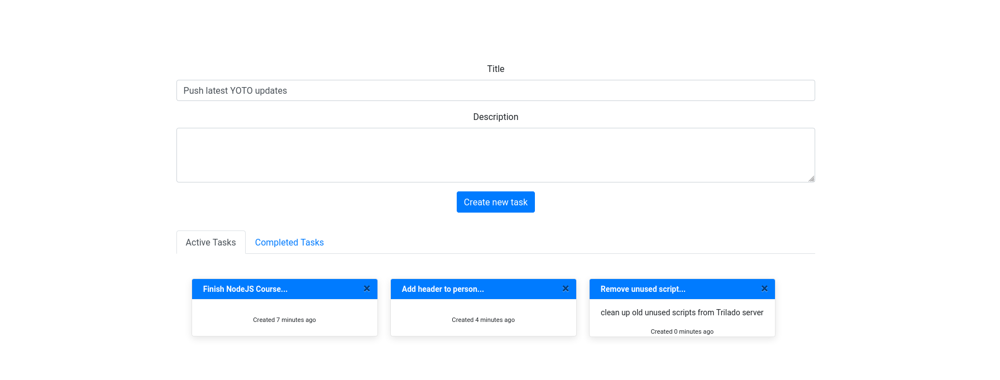

  React to-do app
  <br>
</h1>

<h4 align="center">A minimal Markdown Editor desktop app built on top of <a href="http://electron.atom.io" target="_blank">Electron</a>.</h4>

<p align="center">
  <a href="https://badge.fury.io/js/electron-markdownify">
    
  </a>
  <a href="https://gitter.im/amitmerchant1990/electron-markdownify"></a>
  <a href="https://saythanks.io/to/bullredeyes@gmail.com">
      
  </a>
  <a href="https://www.paypal.me/AmitMerchant">
    
  </a>
</p>

<p align="center">
  <a href="#key-features">Key Features</a> •
  <a href="#how-to-use">How To Use</a> •
  <a href="#download">Download</a> •
  <a href="#related">Related</a> •
  <a href="#license">License</a>
</p>



## Key Features

* Responsive
  - Works accross many resolutions and devices
* React classes
  - Makes use of react classes to implement a provider class to prove state.
* Context API
  - Used to pass state through components
* Bootstrap CSS
  - Uses the Bootstrap CSS framework 

## Demo
Here is a working live demo :  

## How To Use

To clone and run this application, you'll need [Git](https://git-scm.com) and [Node.js](https://nodejs.org/en/download/) (which comes with [npm](http://npmjs.com)) installed on your computer. From your command line:

```bash
# Clone this repository
$ git clone https://github.com/dannyleewalasek/react-todo-app.git

# Go into the repository
$ cd react-todo-app

# Install dependencies
$ npm install

# Run the app
$ npm start
```

Note: If you're using Linux Bash for Windows, [see this guide](https://www.howtogeek.com/261575/how-to-run-graphical-linux-desktop-applications-from-windows-10s-bash-shell/) or use `node` from the command prompt.

## Credits

This software uses the following open source packages:

- [Node.js](https://nodejs.org/)
- [Boostrap](https://getbootstrap.com/)
- [ReactJS](https://reactjs.org/)

## Support

<a href="https://www.buymeacoffee.com/5Zn8Xh3l9" target="_blank"></a>

<p>Or</p> 

<a href="https://www.patreon.com/amitmerchant">
	
</a>

## Other projects of mine...

- [YoKu e-commerce](https://github.com/dannyleewalasek/clothing-ecommerce) - An e-commerce clothing site
- [Trilado](https://github.com/dannyleewalasek/Trilado) - The front end of a film recommendation web app
- [Trilado-Backend](https://github.com/dannyleewalasek/Trilado-Backend) - The back end of the Trilado film recommendation web app

## License

MIT

---


